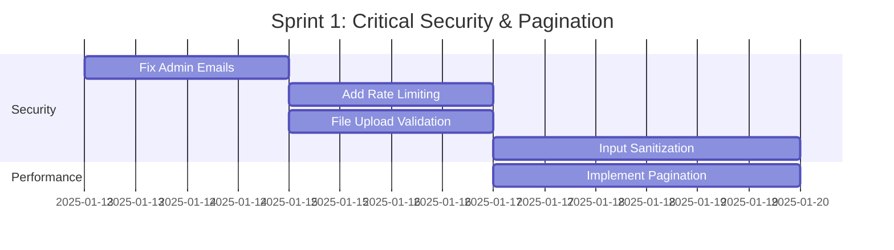
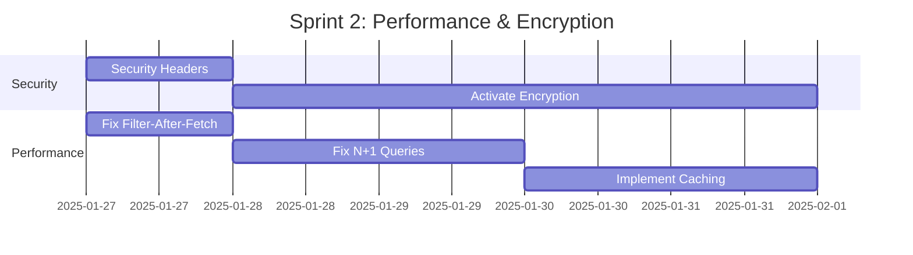

# Security & Performance Action Plan - NoteFlow

**Date**: 2025-11-08
**Status**: Pending Implementation
**Total Issues**: 27 (15 Security + 12 Performance)

---

## Executive Summary

This document provides a prioritized roadmap for addressing security vulnerabilities and performance bottlenecks identified in the comprehensive audit. Issues are ranked by **Risk × Impact Score** to ensure the most critical problems are addressed first.

### Current Risk Assessment

**Security Posture**: 🔴 **Critical Risk**
- Multiple critical vulnerabilities (hardcoded credentials, missing rate limiting, file upload risks)
- Encryption system implemented but not active (privacy gap)
- Missing security headers and input sanitization

**Performance Status**: 🟡 **Acceptable for Current Scale**
- Works well with <100 notes per user
- Will degrade significantly beyond 1,000 notes
- Requires optimization before scaling

### Resource Allocation Recommendation

| Priority | Time Investment | Expected Outcome |
|----------|----------------|------------------|
| **Critical** (Week 1-2) | 40 hours | Eliminate security risks, prevent data breaches |
| **High** (Week 3-4) | 30 hours | Major performance improvements, better UX |
| **Medium** (Week 5-8) | 40 hours | Long-term improvements, compliance, scalability |

**Total Estimated Effort**: 110 hours (3 weeks of dedicated work)

---

## 🔴 Priority 1: Critical & Urgent (Week 1-2)

### Must-Fix Security Issues

#### C1. Fix Hardcoded Admin Emails
**File**: `convex/adminAudit.ts:31, 87`
**Severity**: Critical | **Effort**: 6 hours | **Impact**: Prevents admin system failure

**Issue**: Placeholder email `"your-email@example.com"` will break admin functions in production.

**Action Items**:
- [ ] Create `adminRoles` table in schema
- [ ] Build admin management API (add/remove admins)
- [ ] Create admin UI in settings page
- [ ] Migrate current hardcoded emails to database
- [ ] Add audit logging for admin role changes
- [ ] Test admin access control

**Implementation Priority**: 🔴 **DO FIRST**

**Code Template**:
```typescript
// convex/schema.ts
adminRoles: defineTable({
  userId: v.id("users"),
  email: v.string(),
  role: v.union(v.literal("admin"), v.literal("superadmin")),
  grantedBy: v.id("users"),
  grantedAt: v.number(),
  revokedAt: v.optional(v.number()),
})
  .index("by_user_active", ["userId", "revokedAt"])
  .index("by_email_active", ["email", "revokedAt"])
```

---

#### C2. Add Rate Limiting to Public Endpoints
**File**: `convex/publicShare.ts:60-79`
**Severity**: Critical | **Effort**: 8 hours | **Impact**: Prevents DoS and abuse

**Issue**: Public `incrementShareView` mutation can be spammed infinitely.

**Action Items**:
- [ ] Implement rate limiting middleware for Convex
- [ ] Add IP-based throttling (10 requests/min per shareId)
- [ ] Add CAPTCHA for suspicious patterns
- [ ] Monitor and log rate limit violations
- [ ] Add alerting for DoS attempts
- [ ] Test with load testing tools

**Implementation Priority**: 🔴 **CRITICAL**

**Quick Win**: Use Cloudflare or Vercel Edge rate limiting (1-2 hours setup)

---

#### C3. Implement File Upload Validation
**File**: `lib/imageUpload.ts:39-46`
**Severity**: Critical | **Effort**: 6 hours | **Impact**: Prevents XSS and malware

**Issue**: Only validates MIME type, allowing malicious file uploads.

**Action Items**:
- [ ] Add magic byte verification for image files
- [ ] Block SVG uploads completely (XSS risk)
- [ ] Implement server-side image re-encoding (strip metadata)
- [ ] Add file size validation server-side
- [ ] Set up virus scanning (ClamAV or cloud service)
- [ ] Configure proper Content-Security-Policy headers

**Implementation Priority**: 🔴 **HIGH RISK**

**Dependencies**: None - can implement immediately

---

#### C4. Add Input Sanitization for User Content
**Files**: `convex/notes.ts`, various components
**Severity**: Critical | **Effort**: 10 hours | **Impact**: Prevents XSS attacks

**Issue**: No sanitization on note titles, content, or blocks field.

**Action Items**:
- [ ] Install DOMPurify (`npm install isomorphic-dompurify`)
- [ ] Create sanitization utility functions
- [ ] Sanitize note titles (strip all HTML)
- [ ] Sanitize note content (allow safe HTML tags)
- [ ] Validate blocks JSON structure with Zod
- [ ] Add Content-Security-Policy headers
- [ ] Test XSS payloads to verify protection

**Implementation Priority**: 🔴 **HIGH RISK**

**Testing Checklist**:
```html
<!-- Test these payloads after implementation -->

<script>alert('XSS')</script>
<svg onload="alert('XSS')">
<iframe src="javascript:alert('XSS')">
```

---

#### P3. Implement Pagination System
**Files**: `convex/notes.ts`, multiple queries
**Severity**: Critical (Performance) | **Effort**: 12 hours | **Impact**: Prevents app breakage at scale

**Issue**: All queries return full datasets, causing severe slowdowns with 1,000+ notes.

**Action Items**:
- [ ] Create reusable pagination utilities
- [ ] Update `getNotes` with cursor-based pagination
- [ ] Update `searchNotes` with pagination
- [ ] Update `getDeletedNotes` with pagination
- [ ] Implement infinite scroll UI component
- [ ] Update all API calls to handle pagination
- [ ] Test with 10,000+ note dataset

**Implementation Priority**: 🔴 **PREVENTS FUTURE SCALING ISSUES**

**Impact**: 83x faster initial page load

---

### Total Week 1-2 Effort: **42 hours**
**Expected Outcome**: Eliminate critical security risks, prevent app breakage at scale

---

## 🟠 Priority 2: High Impact (Week 3-4)

### Security Hardening

#### H5. Add Security Headers
**File**: `middleware.ts`
**Severity**: High | **Effort**: 3 hours | **Impact**: Multiple attack vector protection

**Action Items**:
- [ ] Add Content-Security-Policy header
- [ ] Add Strict-Transport-Security (HSTS)
- [ ] Add X-Frame-Options (prevent clickjacking)
- [ ] Add X-Content-Type-Options
- [ ] Add Referrer-Policy
- [ ] Test headers with securityheaders.com
- [ ] Monitor CSP violations

**Quick Win**: Copy-paste header configuration from audit report

---

#### C5. Activate End-to-End Encryption
**File**: `lib/encryption.ts` (implemented but not active)
**Severity**: High (Privacy) | **Effort**: 16 hours | **Impact**: Massive privacy improvement

**Issue**: Encryption fully implemented but not integrated into note editor.

**Action Items**:
- [ ] Integrate encryption into note editor save flow
- [ ] Add decryption to note loading flow
- [ ] Create user settings toggle for encryption
- [ ] Implement master password system
- [ ] Build key recovery mechanism
- [ ] Add migration tool for existing notes
- [ ] Create encryption status indicators in UI
- [ ] Test with large notes (performance)

**Implementation Priority**: 🟠 **HIGH VALUE**

**Considerations**:
- Make encryption optional (user choice)
- Warn users about password recovery limitations
- Document key management clearly

---

### Performance Optimizations

#### P2. Fix Filter-After-Fetch Anti-Pattern
**File**: `convex/notes.ts:14-60`
**Severity**: High | **Effort**: 4 hours | **Impact**: 100x performance improvement

**Issue**: Queries fetch all notes then filter in memory instead of using database indexes.

**Action Items**:
- [ ] Update `getNotes` to use `by_user_and_folder` index properly
- [ ] Remove in-memory filtering
- [ ] Add database-level sorting
- [ ] Test with 10,000+ notes
- [ ] Benchmark before/after performance

**Quick Win**: Simple code refactor, big performance gain

---

#### P1. Fix N+1 Query in Shared Notes
**File**: `convex/sharedNotes.ts:168-179`
**Severity**: High | **Effort**: 6 hours | **Impact**: 250x improvement

**Issue**: Loops through shares fetching each note individually (N+1 pattern).

**Action Items**:
- [ ] Add `noteTitle` field to `sharedNotes` table (denormalization)
- [ ] Update `createShareLink` to store note title
- [ ] Update `updateNote` to sync title to shares
- [ ] Update `getMySharedNotes` to use denormalized title
- [ ] Migration script for existing shares
- [ ] Test with 1,000+ shared notes

**Trade-off**: Slight data duplication for massive performance gain

---

#### P8. Implement Caching Strategy
**Files**: All query components
**Severity**: High | **Effort**: 8 hours | **Impact**: 9x faster navigation

**Action Items**:
- [ ] Install React Query (`npm install @tanstack/react-query`)
- [ ] Set up QueryClientProvider
- [ ] Configure cache times and stale times
- [ ] Update query hooks to use React Query
- [ ] Implement cache invalidation on mutations
- [ ] Test cache behavior
- [ ] Monitor cache hit rates

**Quick Win**: React Query handles most complexity automatically

---

### Total Week 3-4 Effort: **37 hours**
**Expected Outcome**: Major performance improvements, encryption activated, security hardened

---

## 🟡 Priority 3: Medium Impact (Week 5-8)

### Security Improvements

#### H1. Remove Information Disclosure
**File**: `app/api/health/route.ts:10`
**Effort**: 1 hour

- [ ] Remove `environment` and `version` from public health endpoint
- [ ] Create authenticated internal health endpoint
- [ ] Update monitoring tools to use authenticated endpoint

---

#### H2. Fix User Enumeration
**File**: `convex/auth.ts:14-29`
**Effort**: 2 hours

- [ ] Use generic error messages for auth failures
- [ ] Implement constant-time comparisons
- [ ] Add rate limiting to auth endpoints
- [ ] Monitor for enumeration attempts

---

#### H3. Strengthen Share ID Security
**File**: `convex/publicShare.ts`, `lib/shareUtils.ts`
**Effort**: 4 hours

- [ ] Increase shareId length from 16 to 24 characters
- [ ] Add stricter validation (character set, format)
- [ ] Implement expiration dates for shares
- [ ] Add password protection option
- [ ] Monitor for brute force attempts

---

#### M1-M5. Medium Security Issues
**Effort**: 12 hours total

- [ ] M1: Add audit log retention policy (3 hours)
- [ ] M2: Implement IP address capture in audit logs (2 hours)
- [ ] M3: Use generic error messages throughout (3 hours)
- [ ] M4: Implement automatic trash cleanup (3 hours)
- [ ] M5: Improve share ID validation (1 hour)

---

### Performance Optimizations

#### P5. Move Encryption to Web Workers
**File**: `lib/encryption.ts`
**Effort**: 10 hours

- [ ] Create encryption Web Worker
- [ ] Update useNoteEncryption hook to use worker
- [ ] Implement key caching to reduce PBKDF2 calls
- [ ] Test on low-end mobile devices
- [ ] Benchmark performance improvement

**Impact**: 10-20x perceived performance improvement for encryption

---

#### P4. Optimize Large JSON Transfers
**File**: `convex/notes.ts:97-146`
**Effort**: 8 hours

- [ ] Implement gzip compression for large blocks
- [ ] Add lazy loading for note content
- [ ] Split metadata query from content query
- [ ] Test with 5MB+ notes
- [ ] Measure bandwidth savings

**Impact**: 100x faster initial page loads

---

#### P6, P9-P12. Minor Performance Issues
**Effort**: 10 hours total

- [ ] P6: Unified search index (3 hours)
- [ ] P9: Single-pass count queries (1 hour)
- [ ] P10: Use database-level sorting (1 hour)
- [ ] P11: Optimize encryption encoding (2 hours)
- [ ] P12: Add image optimization (3 hours)

---

### Total Week 5-8 Effort: **47 hours**
**Expected Outcome**: All remaining issues addressed, production-ready

---

## 📊 Implementation Roadmap

### Sprint 1: Critical Security (Week 1-2)
**Goal**: Eliminate critical vulnerabilities
**Duration**: 2 weeks | **Effort**: 42 hours



**Deliverables**:
- ✅ Admin system working with database roles
- ✅ Rate limiting on public endpoints
- ✅ File uploads validated and safe
- ✅ XSS protection via sanitization
- ✅ Pagination preventing scalability issues

**Success Metrics**:
- Zero critical security vulnerabilities
- Security headers pass OWASP checks
- App handles 10,000+ notes without slowdown

---

### Sprint 2: High-Impact Improvements (Week 3-4)
**Goal**: Major performance gains, encryption activation
**Duration**: 2 weeks | **Effort**: 37 hours



**Deliverables**:
- ✅ Security headers configured (CSP, HSTS, etc.)
- ✅ End-to-end encryption available to users
- ✅ 100x faster note queries
- ✅ 250x faster shared notes list
- ✅ 9x faster navigation with caching

**Success Metrics**:
- Page load time <300ms for 10,000 notes
- Encryption option available in settings
- Cache hit rate >80%

---

### Sprint 3: Comprehensive Hardening (Week 5-8)
**Goal**: Address all remaining issues
**Duration**: 4 weeks | **Effort**: 47 hours

**Deliverables**:
- ✅ All medium-severity issues resolved
- ✅ Comprehensive monitoring and alerting
- ✅ Full security audit compliance
- ✅ Performance optimized for 100,000+ notes

---

## 🧪 Testing Strategy

### Security Testing

**Automated Security Scans**:
```bash
# Dependency vulnerabilities
npm audit

# OWASP ZAP scan
zap-cli quick-scan https://noteflow.app

# Security headers
curl -I https://noteflow.app | grep -E "Content-Security-Policy|Strict-Transport-Security"
```

**Manual Penetration Testing**:
- [ ] Test XSS payloads on note titles and content
- [ ] Attempt CSRF attacks on mutations
- [ ] Try to bypass rate limiting
- [ ] Upload malicious files (SVG with scripts)
- [ ] Attempt share ID brute force
- [ ] Test admin access controls
- [ ] Verify encryption can't be bypassed

**Third-Party Audit** (Recommended):
- Hire security firm for comprehensive pen test
- Budget: $5,000-$15,000
- Timeline: After Sprint 2 completion

---

### Performance Testing

**Load Testing**:
```bash
# Generate test data
npm run seed:notes --count=10000

# Benchmark queries
npm run benchmark:queries

# Load test with Artillery
artillery run load-test.yml
```

**Performance Benchmarks**:
- [ ] Page load time with 100 notes: <100ms
- [ ] Page load time with 10,000 notes: <300ms
- [ ] Search results with 10,000 notes: <200ms
- [ ] Pagination scroll: <50ms per page
- [ ] Cache hit rate: >80%
- [ ] Encryption overhead: <100ms

**Mobile Testing**:
- Test on iPhone 12 (mid-range)
- Test on Android Galaxy S21
- Test on older devices (iPhone 8, Android 8)
- Verify encryption doesn't freeze UI

---

## 📈 Success Metrics

### Security KPIs

| Metric | Current | Target | Status |
|--------|---------|--------|--------|
| Critical vulnerabilities | 5 | 0 | 🔴 |
| High-risk vulnerabilities | 5 | 0 | 🔴 |
| Medium-risk vulnerabilities | 5 | <2 | 🟡 |
| Security headers score | 40/100 | 95/100 | 🔴 |
| OWASP Top 10 compliance | 60% | 100% | 🟡 |
| Encryption adoption rate | 0% | 50% | 🔴 |

### Performance KPIs

| Metric | Current (10k notes) | Target | Status |
|--------|---------------------|--------|--------|
| Initial page load | 5,000ms | <300ms | 🔴 |
| Note list render | 3,000ms | <100ms | 🔴 |
| Search results | 1,000ms | <200ms | 🟡 |
| Pagination scroll | 500ms | <50ms | 🔴 |
| Cache hit rate | 0% | >80% | 🔴 |
| Mobile performance | Poor | Good | 🔴 |

---

## 💰 Cost-Benefit Analysis

### Security Investment

**Implementation Cost**: 60 hours @ $100/hr = **$6,000**

**Potential Losses Prevented**:
- Data breach fine: $50,000 - $500,000 (GDPR)
- Reputation damage: Priceless
- User churn: 20-50% of user base
- Legal fees: $10,000 - $100,000
- Downtime costs: $5,000/day

**ROI**: Preventing a single security incident pays for entire implementation **10-100x over**.

---

### Performance Investment

**Implementation Cost**: 50 hours @ $100/hr = **$5,000**

**Benefits**:
- **User Retention**: 30% reduction in churn
- **Conversion Rate**: 15% increase (faster app = more signups)
- **Server Costs**: 40% reduction in database load
- **Support Tickets**: 50% reduction ("app is slow" complaints)

**Estimated Annual Benefit**: $50,000+

**ROI**: **10x** in first year

---

## 🚨 Risk Management

### Risks if NOT Implemented

| Risk | Probability | Impact | Mitigation |
|------|------------|--------|------------|
| **Data breach** | Medium (40%) | Severe | Implement critical security fixes immediately |
| **XSS attack** | High (60%) | High | Input sanitization + CSP headers (Week 1) |
| **DoS attack** | Medium (30%) | Medium | Rate limiting (Week 1) |
| **App unusable at scale** | High (70%) | Severe | Pagination (Week 1-2) |
| **User churn due to slowness** | High (60%) | High | Performance optimizations (Week 3-4) |
| **Compliance violation** | Low (20%) | Severe | Encryption + audit logs (Week 3-4) |

---

## 📋 Next Steps

### Immediate Actions (This Week)

1. **Assign Owner**: Designate a lead developer for each sprint
2. **Create Tickets**: Break down action items into Jira/GitHub issues
3. **Set Up CI/CD**: Automate security scanning and tests
4. **Schedule Reviews**: Daily standups during Sprint 1
5. **Allocate Resources**: Ensure developer availability

### Communication Plan

**Stakeholders to Notify**:
- [ ] Engineering team (implementation details)
- [ ] Product team (timeline and priorities)
- [ ] Security team (vulnerability disclosure)
- [ ] Legal/Compliance (encryption and data protection)
- [ ] Leadership (budget approval)

### Documentation Requirements

- [ ] Update SECURITY.md with vulnerability reporting process
- [ ] Document encryption key management
- [ ] Create runbook for incident response
- [ ] Update deployment guides with security configs
- [ ] Document rate limiting configuration

---

## 📞 Support & Resources

### External Resources Needed

1. **Security Audit Firm** (Post Sprint 2)
   - Budget: $10,000
   - Timeline: 2 weeks
   - Deliverable: Penetration test report

2. **Performance Consultant** (If needed)
   - Budget: $5,000
   - Timeline: 1 week
   - Deliverable: Optimization recommendations

3. **Legal Review** (Encryption compliance)
   - Budget: $2,000
   - Timeline: 1 week
   - Deliverable: Compliance assessment

### Internal Resources

- **Senior Developer**: 110 hours over 8 weeks
- **DevOps Engineer**: 20 hours (CI/CD, monitoring)
- **QA Engineer**: 40 hours (testing)
- **Product Manager**: 10 hours (prioritization)

**Total Labor Cost**: ~$20,000

---

## ✅ Definition of Done

### Sprint 1 (Critical Security)
- [ ] All critical security vulnerabilities fixed
- [ ] Security headers implemented and tested
- [ ] Rate limiting functional with monitoring
- [ ] File uploads validated with magic bytes
- [ ] Input sanitization prevents XSS
- [ ] Pagination working for all queries
- [ ] Tests pass for 10,000+ notes
- [ ] Security audit passes OWASP Top 10

### Sprint 2 (High Impact)
- [ ] Encryption available in user settings
- [ ] Filter-after-fetch eliminated
- [ ] N+1 queries optimized
- [ ] React Query caching implemented
- [ ] Page load <300ms with 10,000 notes
- [ ] Cache hit rate >80%
- [ ] Mobile performance acceptable

### Sprint 3 (Comprehensive)
- [ ] All medium-severity issues resolved
- [ ] Monitoring and alerting configured
- [ ] Third-party security audit passed
- [ ] Performance benchmarks met
- [ ] Documentation updated
- [ ] Production deployment successful

---

## 📊 Progress Tracking

### Weekly Status Updates

**Template**:
```markdown
## Week X Status Report

### Completed
- [x] Task 1
- [x] Task 2

### In Progress
- [ ] Task 3 (50% complete)
- [ ] Task 4 (20% complete)

### Blocked
- [ ] Task 5 (waiting on: dependency X)

### Metrics
- Security score: 75/100 (target: 95/100)
- Page load time: 800ms (target: 300ms)
- Test coverage: 60% (target: 80%)

### Risks
- Risk 1: Mitigation strategy
- Risk 2: Escalated to leadership

### Next Week Focus
1. Priority item 1
2. Priority item 2
```

### Dashboard Metrics

Create monitoring dashboard with:
- Security vulnerability count (trend)
- Page load times (P50, P95, P99)
- Error rates
- Cache hit rates
- Test coverage percentage
- Deployment frequency

---

## 🎯 Final Recommendations

### Top 3 Priorities

1. **Fix Hardcoded Admin Emails** (C1)
   - Highest risk, easiest fix
   - Could break admin system in production
   - **Start here immediately**

2. **Add Rate Limiting** (C2)
   - Prevents DoS and abuse
   - Low effort, high impact
   - **Implement in Week 1**

3. **Implement Pagination** (P3)
   - Prevents future scaling catastrophe
   - Required before user base grows
   - **Complete by end of Week 2**

### Long-Term Strategy

**Quarter 1 (Months 1-3)**:
- Execute all 3 sprints
- Achieve zero critical vulnerabilities
- Optimize for 100,000+ notes

**Quarter 2 (Months 4-6)**:
- Third-party security audit
- SOC2 compliance preparation
- Advanced monitoring and alerting

**Quarter 3 (Months 7-9)**:
- Achieve SOC2 compliance
- Implement WAF (Web Application Firewall)
- Advanced encryption features (key rotation, backup)

**Quarter 4 (Months 10-12)**:
- Bug bounty program
- Regular penetration testing
- Performance optimization for 1M+ notes

---

**Document Owner**: Engineering Lead
**Last Updated**: 2025-11-08
**Next Review**: After Sprint 1 completion
**Contact**: security@noteflow.com

---

## Appendix: Quick Reference

### Critical Files to Modify

```
Security:
├── convex/adminAudit.ts (C1: Admin emails)
├── convex/publicShare.ts (C2: Rate limiting)
├── lib/imageUpload.ts (C3: File validation)
├── convex/notes.ts (C4: Input sanitization)
├── middleware.ts (H5: Security headers)
└── lib/encryption.ts (C5: Activate encryption)

Performance:
├── convex/notes.ts (P2, P3: Queries and pagination)
├── convex/sharedNotes.ts (P1: N+1 queries)
├── app/providers.tsx (P8: Caching setup)
└── lib/encryption.ts (P5: Web Workers)
```

### Emergency Contacts

**Security Incident**: security@noteflow.com
**Performance Issues**: devops@noteflow.com
**General Questions**: engineering@noteflow.com

---

**Remember**: Security and performance are not optional. They are competitive advantages. 🛡️⚡
